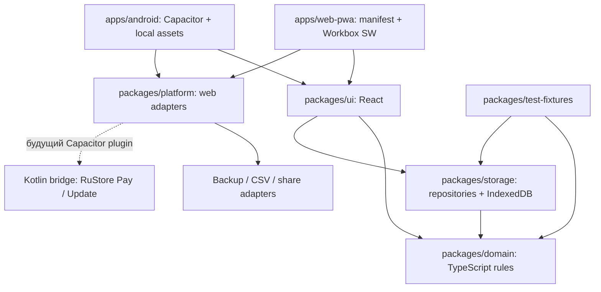

# Архитектура PWA и Android/Capacitor

## Рекомендуемый вариант

Основной продукт — единое **React + TypeScript offline-first приложение** с двумя способами доставки:

- installable PWA для Safari на iPhone/iPad и запуска с Home Screen;
- Android-приложение для RuStore через Capacitor, которое содержит тот же локально собранный UI и domain-код.

Это не hosted WebView: production Android build не содержит `server.url`, не открывает удалённый сайт и не требует сети для core-сценария. PWA после первого успешного HTTPS-открытия и установки также работает offline.

## Почему этот вариант

| Критерий | React/TypeScript PWA + Capacitor | Отдельные native iOS/Android | Flutter |
|---|---|---|---|
| iOS без App Store | Installable Safari/Home Screen PWA | Нужна отдельная доставка | Нужна отдельная доставка |
| RuStore | Локальные assets внутри AAB | Прямой native-клиент | Android-сборка |
| Одна маленькая команда | Один domain и UI | Две реализации | Один UI, но PWA-доставка не основная |
| Offline-first | IndexedDB + service worker | Две storage-реализации | Отдельная web/PWA-адаптация |
| RuStore SDK | Тонкие Kotlin bridges | Прямой доступ | Плагины/platform channels |

PWA и Android имеют одинаковую бизнес-семантику и основной UI. Платформенные различия скрываются адаптерами, а не условными ветками внутри расчётов.

## Поток зависимостей



Правила зависимостей:

- `packages/domain` не импортирует React, DOM, IndexedDB, Capacitor или SDK магазина;
- `packages/ui` зависит от domain use cases и интерфейсов, но не от конкретного IndexedDB API;
- `packages/storage` реализует repositories, migrations и атомарные транзакции IndexedDB;
- `packages/platform` предоставляет web/Capacitor-адаптеры файлов, share, lifecycle и будущих store services;
- приложения только собирают зависимости и содержат platform bootstrapping;
- Excel не импортируется в runtime и связан с кодом только fixtures/контрактами.

## Monorepo

```text
apps/
├── web-pwa/            React entry, HTTPS deploy, manifest, Workbox service worker
└── android/            Capacitor config, Android project, local web assets, Kotlin bridges
packages/
├── domain/             Money, операции, лимиты, use cases, validation
├── storage/            IndexedDB schema, repositories, migrations, backup codecs
├── platform/           Web/Capacitor adapters, files, share, notifications, store ports
├── ui/                 Общие React-компоненты, screens и accessibility
└── test-fixtures/      Package-адаптер для schemas/fixtures из корневого contracts/
```

На уровне репозитория также остаются `docs/`, `excel-template/` и корневой `contracts/` — канонический машиночитаемый источник JSON Schema/golden fixtures для Excel и приложения. `packages/test-fixtures` валидирует, типизирует и экспортирует эти файлы тестам без создания второй копии. Инструменты сборки, lint, typecheck и тесты запускаются из корня monorepo.

## Offline и установка PWA

`apps/web-pwa` включает:

- web app manifest с `display: standalone`, корректными `start_url`, `scope`, именем, theme/background colors и иконками;
- service worker, собранный Workbox, с precache для app shell, шрифтов и versioned static assets;
- navigation fallback на локальный app shell;
- управляемый update flow: новая версия не должна молча прерывать ввод или удалять данные;
- понятную инструкцию Safari «Поделиться → На экран Домой»;
- экран состояния offline и резервной копии без обещания фоновой синхронизации.

Первый web-визит требует HTTPS и сети. Критерий offline начинается после успешной загрузки service worker и установки/кэширования. Нельзя кэшировать ответы с персональными данными через общий HTTP cache; финансовые данные остаются в IndexedDB.

## Android/Capacitor contract

`apps/android` получает production build общих React/TypeScript assets через `webDir` и включает их в APK/AAB. Обязательные ограничения:

- `server.url` отсутствует во всех production-конфигурациях и flavors;
- remote live-reload разрешён только в явно отделённой development-конфигурации, которая не попадает в release artifact;
- core UI и данные не зависят от доступности PWA-домена;
- первый запуск установленного APK/APKS в airplane mode открывает полный app shell;
- URL navigation ограничена allowlist; внешние ссылки открываются системно и не подменяют приложение;
- CSP и build не допускают удалённого исполняемого кода для core-функций;
- Kotlin существует только в shell/Capacitor plugins, не дублирует domain-расчёты.

## Хранилище

IndexedDB — единственный источник истины для PWA и Capacitor MVP. `packages/storage` владеет schema version, миграциями, транзакциями и codecs резервной копии.

### Контракт Storage v2

Версия IndexedDB, версия формата backup и версия payload изменяются независимо. Для первой миграции IndexedDB `v1 → v2` действуют следующие правила:

- upgrade выполняется только внутри `onupgradeneeded` и одной `versionchange`-транзакции;
- все преобразования записей завершаются до commit этой транзакции; ошибка или невалидный stored document вызывает `abort`, поэтому частично обновлённая база не становится доступной; rollback доказывается двумя документами v1, где custom `migrateV1Value` принимает первый и отклоняет невалидную дробную сумму во втором;
- соединение закрывается при `versionchange`, чтобы другая вкладка или новая версия приложения могла продолжить upgrade;
- состояние `blocked` не замалчивается: вызывающая сторона получает точную контролируемую ошибку «Обновление локального хранилища заблокировано другой вкладкой.»; после закрытия удерживающего соединения новый вызов open можно повторить;
- миграции последовательны и идемпотентны на уровне версии: существующая база `v1` проходит шаг `1 → 2`, а уже открытая `v2` не преобразуется повторно.

Внешний backup до restore проходит два слоя codec: общий guard ограничивает размер, глубину, количество узлов/элементов, небезопасные числа, duplicate ID и ключи `__proto__`, `prototype`, `constructor`; обязательный `BudgetState` application validator проверяет accounts, categories, budgets и их lines, goals, annual commitments, schedules, transactions, их safe-integer money/date/enum и фактически существующие account/category/budget/goal/transaction references. Оба слоя выполняются до открытия write-транзакции restore; ошибка не должна менять ни активный документ, ни metadata. `BudgetState` не содержит household/member, а domain-проекция не хранит canonical movements/splits, поэтому их проверка этим codec не заявляется. Обычный `save()` остаётся типизированным repository API и получает уже проверенный application state — generic repository не подменяет domain validation.

JSON backup имеет versioned envelope:

```json
{
  "app": "family-budget",
  "appVersion": "0.1.0",
  "formatVersion": 2,
  "schemaVersion": 1,
  "createdAt": "2026-07-17T12:00:00.000Z",
  "integrity": {
    "algorithm": "sha256",
    "checksum": "44136fa355b3678a1146ad16f7e8649e94fb4fc21fe77e8310c060f61caaff8a"
  },
  "payload": {}
}
```

`app` не даёт импортировать файл другого продукта, `appVersion` фиксирует версию создавшего приложение, `formatVersion` версионирует envelope, а `schemaVersion` — модель внутри `payload`. В текущем контракте это соответственно `family-budget`, строка версии приложения, `2` и `1`. Backup `schemaVersion: 1` не равен `schemaVersion: 2` внутреннего IndexedDB `StoredDocument`: это разные уровни совместимости. `createdAt` — UTC ISO 8601. SHA-256 вычисляется по однозначно сериализованному payload и сверяется до restore. Эта проверка целостности обнаруживает случайное повреждение файла, но **не является шифрованием, электронной подписью или аутентификацией**: пользователь должен хранить backup как незашифрованные финансовые данные.

Размер входного JSON ограничен `5 MiB` (`5 × 1024 × 1024` UTF-8 bytes) до разбора. После проверки размера envelope, integrity, schema и фактических `BudgetState`-ссылок restore записывает текущий активный документ одной IndexedDB-транзакцией. Чужой `app`, неподдерживаемый `formatVersion`/`schemaVersion`, duplicate UUID, опасный ключ, оборванная связь или превышение лимита отклоняются без записи.

Единственный compatibility-path для Phase 0 принимает ровно legacy envelope `{ backupVersion: 1, createdAt, app, payload }`, где `app = "family-budget"` и `createdAt` — строгий UTC ISO timestamp. В legacy-файле нет checksum, и import не придумывает для него integrity: сначала остаются обязательными лимит `5 MiB`, точная проверка envelope и generic guard, затем тот же `BudgetState` application validator, и только после этого разрешён write. Современный export legacy-формат не создаёт и всегда пишет `formatVersion: 2`, payload `schemaVersion: 1` и SHA-256 checksum. Другие backup migrations не заявлены.

Metadata `lastSuccessfulBackup` хранится в IndexedDB, а не в `localStorage`, и содержит только точный UTC ISO timestamp последней успешно сформированной JSON-копии. Версии и checksum в metadata не дублируются. Вызывающий application layer записывает timestamp только после успешного формирования backup; ошибка не должна заменять прежнее значение. `clear()` в одной транзакции очищает пользовательские документы и эту metadata, оставляя пустую рабочую схему IndexedDB v2; отмена или ошибка не даёт частично очищенного состояния.

CSV — отдельный ограниченный по размеру человекочитаемый экспорт таблицы, а не средство восстановления и не полная backup-копия. Он не содержит достаточного контракта для round-trip всех UUID и связей. Поля экранируются по правилам CSV. Для строк codec обнаруживает `=`, `+`, `-` или `@` как сразу, так и после ограниченного максимальной длиной поля префикса пробелов, C0/C1 controls, zero-width/invisible Unicode и bidi controls (`U+061C`, `U+2066…U+2069`), затем добавляет апостроф. Safe-integer `-12345` остаётся числом `-12345`, а пользовательская строка `"-12345"` защищается апострофом.

Автоматизированный контракт Storage v2 принят: storage `28/28`, web `24/24`, fixtures `6/6`, domain `17/17`, суммарно `75/75`, пять typechecks, production PWA build с `13` precache entries, dependency audits `0`, свежие code/security review `APPROVE` без blocker/high/medium. Проверены `12 345` копеек при `v1 → v2`, timestamp `2026-07-17T12:00:00.000Z`, байт-в-байт сохранение прежних raw-данных при отказах, `0` документов после clear и projected G-001 `2/3/1/3/1/0/0/5` с income/expense/net worth `100 000 / 76 500 / 23 500 ₽`.

Остаются низкие тестовые caveats: `versionchange`-close handler не имеет отдельного synthetic lifecycle-теста, а checksum rejection и repository no-write доказаны соседними, не одним сквозным тестом. Реальные browser/device-проверки и Phase 7 UI этого архитектурного acceptance не входят.

Минимальное масштабируемое ядро:

| Сущность | Основные поля |
|---|---|
| `Household` | UUID, название, базовая валюта, timezone, день начала периода |
| `Member` | UUID, householdId, displayName, локальная роль, archivedAt |
| `Account` | UUID, тип, валюта, начальный баланс, active |
| `Category` | UUID, parentId, тип, группа, название, active, sortOrder |
| `BudgetPeriod` | UUID, startDate, endDate, `draft/open/closed` |
| `BudgetLine` | periodId, categoryId, plannedMinor, rolloverMinor, adjustmentMinor, warnPercent |
| `AnnualCommitment` | UUID, categoryId, dueDate, amountMinor, reservedMinor, `annual/one_time`, active |
| `ScheduledExpense` | UUID, categoryId, amountMinor, dueDay, `monthly/selected_months`, calendarMonths, active |
| `Transaction` | UUID, kind, amountMinor, memberId, optionalGoalId, occurredOn, timestamps, status |
| `AccountMovement` | transactionId, accountId, signedAmountMinor, role `source/destination` |
| `TransactionSplit` | transactionId, categoryId/назначение, amountMinor |
| `Goal` | targetMinor, deadline, linkedAccountId/правило расчёта |
| `AlertEvent` | rule, severity, threshold, firedAt, acknowledgedAt |
| `AuditEvent` | objectId, action, revision, actorId, timestamp |

Поля `revision`, `updatedAt`, `deletedAt` закладываются сразу, хотя сервер появится позже.

## Инварианты

- деньги хранятся целым числом копеек и валидируются как safe integer;
- сумма операции положительная, направление задаёт `kind`;
- сумма splits для категоризируемой операции равна сумме заголовка;
- доход/возврат создаёт положительное движение по одному внутреннему счёту, расход — отрицательное;
- перевод создаёт ровно два связанных движения с нулевой суммой;
- взнос в цель — атомарный двухсчётный перевод с `optionalGoalId`, не влияющий на доход/расход;
- заголовок операции и движения записываются одной IndexedDB-транзакцией; частичный перевод невозможен;
- возврат уменьшает факт исходной категории;
- только `posted` входит в фактические показатели;
- использованная категория деактивируется, а не физически удаляется;
- бюджетный период определяется локальной датой и timezone семьи;
- категория не определяет расписание: внутри категории «Дети» одновременно допустимы сезонное обучение, разовый лагерь и повседневные покупки;
- крупный платёж вычитается из доступных денег через резерв к сроку, а в месяце оплаты показывается как движение из резерва без двойного расхода;
- горизонт строится одинаково для 12 и 24 месяцев; сезонная сумма включается только в явно выбранные месяцы;
- миграция либо завершается полностью, либо старая версия данных остаётся восстанавливаемой.

## Best-effort storage и резервные копии

Safari/browser storage нельзя считать гарантированным бессрочным архивом. Поэтому:

- приложение при возможности запрашивает persistent storage, но не обещает, что запрос будет поддержан или удовлетворён;
- versioned JSON backup содержит все сущности, UUID, `appVersion`, `formatVersion`, payload `schemaVersion`, время создания и SHA-256 checksum;
- CSV остаётся читаемым экспортом, но не считается полной резервной копией;
- import ограничен `5 MiB`, сначала полностью валидируется codec, затем применяется атомарно и выдаёт отчёт;
- onboarding объясняет риск удаления данных браузером/устройством;
- дашборд показывает единственный сохранённый metadata timestamp последней успешно сформированной backup-копии и ненавязчиво напоминает обновить её;
- integrity checksum помогает заметить случайную порчу, но не подтверждает автора файла;
- экспортированный JSON/CSV не шифруется и не аутентифицируется автоматически, что явно сообщается пользователю.

## Privacy и security первого релиза

- без регистрации, backend и обязательного интернета;
- без чтения SMS, контактов, банковских данных и других необязательных разрешений;
- суммы, категории, заметки и backup contents отсутствуют в production-логах и crash metadata;
- данные приложения не помещаются в service-worker cache, localStorage или URL;
- CSP, dependency audit и запрет remote code проверяются для release build;
- пользователь может экспортировать, восстановить и удалить локальные данные;
- телеметрия либо отсутствует, либо отдельно согласована, минимальна и соответствует privacy-декларации.

Перед облаком, аккаунтами или платежами проводится отдельный threat model и правовой обзор обработки персональных данных.

## Будущие RuStore bridges

TypeScript определяет узкие интерфейсы `StorePayments` и `StoreUpdates`. В MVP используются безопасные no-op/unsupported реализации. После отдельного решения:

- `apps/android` добавляет актуальный RuStore Pay или Update SDK;
- небольшой Kotlin Capacitor plugin переводит только platform DTO и события;
- server-side проверка покупки появляется вместе с коммерческим backend;
- PWA остаётся работоспособной без этих Android-only возможностей;
- отсутствие bridge не ломает запуск, бюджет и backup.

## Технические spikes до фиксации зависимостей

1. Safari/Home Screen: установка, standalone, quota/eviction, service-worker update и Files/Share export-import.
2. IndexedDB: schema migrations, атомарный transfer и backup/restore round-trip.
3. Workbox: precache, offline navigation и контролируемое обновление приложения.
4. Capacitor: local `webDir`, отсутствие `server.url`, CSP и airplane-mode first launch.
5. Подписанный AAB, слабое устройство, Android System WebView и RuStore alpha track.
6. Библиотека графиков: лицензия, accessibility, размер и производительность в Safari/WebView.

Версии библиотек и минимальные версии платформ фиксируются после spikes по официальным release notes и реальным устройствам.
